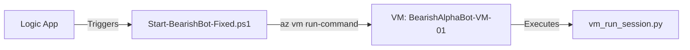
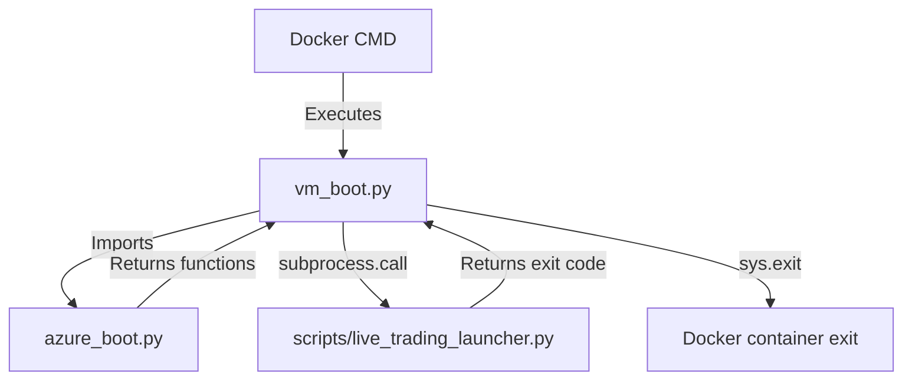
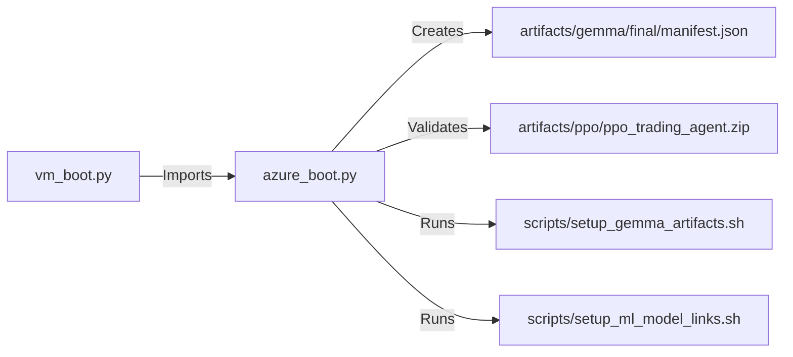
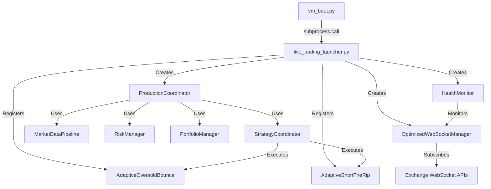

# 🏗️ VM Docker Architecture - Complete System Documentation

**Last Updated:** December 3, 2025  
**Architecture:** Azure VM + Docker Container  
**Status:** ✅ Production Active

---

## 📋 Table of Contents

1. [System Overview](#system-overview)
2. [5-File Architecture](#5-file-architecture)
3. [Execution Flow](#execution-flow)
4. [Data Flow & Dependencies](#data-flow--dependencies)
5. [Lifecycle Management](#lifecycle-management)
6. [Integration Points](#integration-points)
7. [Configuration & Environment](#configuration--environment)
8. [Error Handling & Recovery](#error-handling--recovery)

---

## 🎯 System Overview

### Architecture Diagram

```text
┌─────────────────────────────────────────────────────────────────┐
│                      AZURE AUTOMATION                           │
│  ┌──────────────────────────────────────────────────────────┐  │
│  │  Logic App (Schedule: 23:00 CET Daily)                   │  │
│  │  └─► Triggers Runbook with parameters                    │  │
│  └──────────────────────────────────────────────────────────┘  │
│                              ↓                                  │
│  ┌──────────────────────────────────────────────────────────┐  │
│  │  Start-BearishBot-Fixed.ps1 (Azure Runbook)             │  │
│  │  • Managed Identity authentication                       │  │
│  │  • Concurrent execution prevention                       │  │
│  │  • VM RunCommand orchestration                           │  │
│  └──────────────────────────────────────────────────────────┘  │
└─────────────────────────────────────────────────────────────────┘
                               ↓
┌─────────────────────────────────────────────────────────────────┐
│                    AZURE VM (BearishAlphaBot-VM-01)             │
│  ┌──────────────────────────────────────────────────────────┐  │
│  │  vm_run_session.py (Docker Management Script)            │  │
│  │  • docker stop/rm/pull/run orchestration                 │  │
│  │  • Volume mounting (/mnt/bearish/logs, /mnt/bearish/data)│  │
│  │  • Image management (ACR pull)                           │  │
│  └──────────────────────────────────────────────────────────┘  │
│                              ↓                                  │
│  ┌──────────────────────────────────────────────────────────┐  │
│  │  Docker Container (bearish-bot)                          │  │
│  │  Image: bearishalphabot.azurecr.io/bearish-bot:vm-vmboot-11│
│  │                                                           │  │
│  │  ┌────────────────────────────────────────────────────┐  │  │
│  │  │  vm_boot.py (Container Entry Point)               │  │  │
│  │  │  CMD ["python", "vm_boot.py"]                      │  │  │
│  │  │                                                     │  │  │
│  │  │  1. Imports azure_boot utilities                   │  │  │
│  │  │  2. Calls setup functions                          │  │  │
│  │  │  3. Builds launcher arguments                      │  │  │
│  │  │  4. Executes subprocess                            │  │  │
│  │  └────────────────────────────────────────────────────┘  │  │
│  │                       ↓                                   │  │
│  │  ┌────────────────────────────────────────────────────┐  │  │
│  │  │  azure_boot.py (Utility Library)                   │  │  │
│  │  │  • setup_environment()                             │  │  │
│  │  │  • ensure_directories()                            │  │  │
│  │  │  • setup_default_manifest() [GEMMA-2.0.0]         │  │  │
│  │  │  • setup_ml_environment()                          │  │  │
│  │  └────────────────────────────────────────────────────┘  │  │
│  │                       ↓                                   │  │
│  │  ┌────────────────────────────────────────────────────┐  │  │
│  │  │  scripts/live_trading_launcher.py (Bot Launcher)   │  │  │
│  │  │  • LiveTradingLauncher (main orchestrator)         │  │  │
│  │  │  • ProductionCoordinator integration               │  │  │
│  │  │  • WebSocket management                            │  │  │
│  │  │  • Strategy execution loop                         │  │  │
│  │  │  • Health monitoring                               │  │  │
│  │  │  • Graceful shutdown                               │  │  │
│  │  └────────────────────────────────────────────────────┘  │  │
│  └──────────────────────────────────────────────────────────┘  │
└─────────────────────────────────────────────────────────────────┘
```

---

## 🗂️ 5-File Architecture

### File 1: `Start-BearishBot-Fixed.ps1`

**Location:** `azure_automation/Start-BearishBot-Fixed.ps1`  
**Type:** Azure Automation Runbook (PowerShell)  
**Role:** 🎬 **Orchestration Layer** - Automation trigger & VM management

#### 📌 Responsibilities

| Responsibility | Description |
|---------------|-------------|
| **Authentication** | Uses Managed Identity to connect to Azure resources |
| **Concurrency Control** | Prevents multiple bot instances via container status check |
| **VM Communication** | Executes `vm_run_session.py` via `az vm run-command invoke` |
| **Parameter Validation** | Validates ImageTag, DurationMinutes, ResourceGroup |
| **Error Handling** | Captures and logs VM command execution errors |
| **Async Execution** | Returns immediately after triggering (non-blocking) |

#### 🔗 Connected Components



#### 📊 Data Inputs

| Input | Source | Type | Required |
|-------|--------|------|----------|
| `ResourceGroup` | Logic App parameter | String | ✅ Yes |
| `VMName` | Logic App parameter | String | ✅ Yes |
| `ImageTag` | Logic App parameter | String | ❌ No (default: vm-vmboot-11) |
| `DurationMinutes` | Logic App parameter | Int | ❌ No (default: 60) |
| `IdempotencyToken` | Logic App (Job ID) | String | ❌ No |
| `ForceRestart` | Logic App parameter | Boolean | ❌ No (default: false) |

#### 🔄 Data Outputs

| Output | Destination | Format |
|--------|-------------|--------|
| Execution logs | Azure Automation Job Output | Text stream |
| Bot status | Logic App (return value) | JSON |
| Error messages | Stderr | Text stream |

#### 📝 Key Functions

```powershell
# Main execution flow
1. Connect-AzAccount -Identity (Managed Identity auth)
2. Check if bot is already running (docker ps filter)
3. Build vm_run_session.py command with parameters
4. Execute via az vm run-command invoke --command-id RunShellScript
5. Log output and return status
```

#### ⚙️ Configuration Sources

- **Parameters:** Passed from Logic App (schedule trigger)
- **Secrets:** None (credentials handled by Managed Identity)
- **Environment:** Azure Automation Account (tradebot-automation)

---

### File 2: `vm_run_session.py`

**Location:** `scripts/vm_run_session.py` (deployed to VM: `/home/azureuser/vm_run_session.py`)  
**Type:** Python Script  
**Role:** 🐳 **Docker Management Layer** - Container lifecycle orchestration

#### 📌 Responsibilities

| Responsibility | Description |
|---------------|-------------|
| **Container Cleanup** | Stops and removes existing `bearish-bot` container |
| **Image Management** | Pulls latest image from Azure Container Registry (ACR) |
| **Volume Mounting** | Mounts host directories for logs and data persistence |
| **Container Execution** | Starts new container with proper configuration |
| **Idempotency** | Handles "container not found" errors gracefully (expected) |
| **Error Reporting** | Distinguishes critical vs non-critical failures |

#### 🔗 Connected Components

```mermaid
graph LR
    A[Start-BearishBot-Fixed.ps1] -->|Calls| B[vm_run_session.py]
    B -->|docker commands| C[Docker Daemon]
    C -->|pull| D[ACR: bearishalphabot.azurecr.io]
    C -->|run| E[Container: bearish-bot]
    E -->|mounts| F[/mnt/bearish/logs]
    E -->|mounts| G[/mnt/bearish/data]
```

#### 📊 Data Inputs

| Input | Source | Type | Default |
|-------|--------|------|---------|
| `--image` | Runbook argument | String | `bearishalphabot.azurecr.io/bearish-bot:vm-vmboot-11` |
| `--env-file` | VM host path | String | `/home/azureuser/bearish-bot.env` |
| `--name` | Runbook argument | String | `bearish-bot` |
| `--logs-host` | Runbook argument | String | `/mnt/bearish/logs` |
| `--data-host` | Runbook argument | String | `/mnt/bearish/data` |
| `--restart-policy` | Runbook argument | String | `no` (default, no auto-restart) |
| `--no-volumes` | Flag | Boolean | False |
| `--just-print` | Flag (debug) | Boolean | False |

#### 🔄 Data Outputs

| Output | Destination | Format |
|--------|-------------|--------|
| Docker command logs | Stdout | Text stream |
| Error messages | Stderr (captured) | Text stream |
| Container ID | Docker daemon | String (container hash) |

#### 📝 Key Functions

```python
def main(argv: list[str] | None = None) -> int:
    """
    1. Parse arguments (image, env-file, volumes, restart policy)
    2. Build Docker commands:
       - sudo docker stop bearish-bot
       - sudo docker rm bearish-bot
       - sudo docker pull <image>
       - sudo docker run -d --name bearish-bot --env-file <env> -v <logs> -v <data> <image>
    3. Execute commands sequentially
    4. Capture output (suppress stderr for expected failures)
    5. Return exit code (0 = success, non-zero = failure)
    """
```

#### ⚙️ Configuration Sources

- **CLI Arguments:** Passed from Runbook via `az vm run-command`
- **Env File:** `/home/azureuser/bearish-bot.env` (contains TRADING_MODE, EXCHANGES, API keys, etc.)
- **Docker Daemon:** Local Docker socket (`/var/run/docker.sock`)

#### 🛡️ Error Handling

| Error Scenario | Handling | Exit Code |
|---------------|----------|-----------|
| Container not found (stop/rm) | ℹ️ Log "Container not found (expected)" | 0 (continue) |
| Image pull failure | ❌ Log stderr, abort | Non-zero |
| Container run failure | ❌ Log stderr, abort | Non-zero |
| Env file missing | ❌ Docker run fails | Non-zero |

---

### File 3: `vm_boot.py`

**Location:** `vm_boot.py` (root directory, copied to Docker image `/app/vm_boot.py`)  
**Type:** Python Script  
**Role:** 🚪 **Container Entry Point** - Environment setup & launcher invocation

#### 📌 Responsibilities

| Responsibility | Description |
|---------------|-------------|
| **Import Safety** | Validates `azure_boot` module availability |
| **Environment Setup** | Calls `azure_boot` setup functions in correct order |
| **Argument Builder** | Reads env vars and builds CLI args for `live_trading_launcher.py` |
| **Subprocess Execution** | Launches trading bot as subprocess |
| **Exit Code Propagation** | Returns launcher exit code to Docker |
| **Logging** | Logs startup sequence and environment details |

#### 🔗 Connected Components



#### 📊 Data Inputs

| Input | Source | Type | Default |
|-------|--------|------|---------|
| `TRADING_MODE` | Container env var | String | `paper` |
| `DEBUG_MODE` | Container env var | String | `false` |
| `TRADING_DURATION` | Container env var | String | None (unset) |
| `EXCHANGES` | Container env var | String | `bingx` |

#### 🔄 Data Outputs

| Output | Destination | Format |
|--------|-------------|--------|
| Startup logs | Stdout | Text stream |
| Environment info | Stdout | Key-value pairs |
| Exit code | Docker runtime | Integer (0-255) |

#### 📝 Key Functions

```python
def build_mode_args() -> list[str]:
    """
    Reads environment variables and builds CLI arguments:
    - TRADING_MODE != 'live' → adds '--paper'
    - DEBUG_MODE == 'true' → adds '--debug'
    - TRADING_DURATION set → adds '--duration <seconds>'
    
    Returns: List of arguments for live_trading_launcher.py
    """

def main() -> int:
    """
    1. Log startup info (Python version, working directory)
    2. Call azure_boot setup functions:
       - setup_environment() [PYTHONPATH]
       - ensure_directories() [logs/, data/, artifacts/]
       - setup_default_manifest() [GEMMA-2.0.0 manifest.json]
       - setup_ml_environment() [ML env vars, setup scripts]
    3. Build mode arguments from env vars
    4. Execute: subprocess.call(['python', 'scripts/live_trading_launcher.py', *args])
    5. Log completion status (success ✅ or warning ⚠️)
    6. Return exit code
    """
```

#### ⚙️ Configuration Sources

- **Environment Variables:** Container runtime (set in `bearish-bot.env` file)
- **azure_boot.py:** Utility functions for setup
- **Dockerfile:** `CMD ["python", "vm_boot.py"]`

#### 🛡️ Error Handling

| Error Scenario | Handling | Exit Code |
|---------------|----------|-----------|
| `azure_boot` import fails | Log error, exit | 1 |
| `TRADING_DURATION` invalid | Log warning, skip parameter | 0 (continue) |
| Launcher script not found | Log error (FileNotFoundError) | 127 |
| Launcher execution exception | Log error, exit | 1 |

---

### File 4: `azure_boot.py`

**Location:** `azure_boot.py` (root directory, copied to Docker image `/app/azure_boot.py`)  
**Type:** Python Module  
**Role:** 🔧 **Utility Library** - Environment setup functions

#### 📌 Responsibilities

| Responsibility | Description |
|---------------|-------------|
| **PYTHONPATH Configuration** | Adds `/app`, `/app/src`, `/app/scripts` to Python path |
| **Directory Creation** | Creates required directories (logs, data, artifacts, features, cache) |
| **Manifest Management** | Creates GEMMA-2.0.0 manifest.json if missing (82 features) |
| **ML Environment Setup** | Sets GEMMA env vars, runs setup scripts, validates artifacts |
| **Pre-flight Validation** | Checks for GEMMA manifest and PPO model existence |

#### 🔗 Connected Components



#### 📊 Data Inputs

| Input | Source | Type | Optional |
|-------|--------|------|----------|
| `manifest_path` | Function argument | String | ✅ Yes (default: env var or artifacts/gemma/final/manifest.json) |
| `GEMMA_MANIFEST_PATH` | Environment variable | String | ✅ Yes |

#### 🔄 Data Outputs

| Output | Destination | Format |
|--------|-------------|--------|
| PYTHONPATH | `os.environ` | String (colon-separated paths) |
| Directories | File system | Created directories |
| manifest.json | `artifacts/gemma/final/` | JSON file (GEMMA-2.0.0 spec) |
| GEMMA_ENABLED | `os.environ` | String (`'true'`) |
| ML_ACTIVE_BUNDLE | `os.environ` | String (`'artifacts/gemma/final'`) |

#### 📝 Key Functions

```python
def setup_environment():
    """
    Configures PYTHONPATH for project structure.
    - Adds current_dir, current_dir/src, current_dir/scripts to sys.path
    - Sets PYTHONPATH env var for subprocesses
    """

def ensure_directories():
    """
    Creates required directory structure:
    - logs/, data/, artifacts/gemma/final, artifacts/ppo
    - features/gemma/selected, data/models/final, data/cache/gemma
    - Placeholder files: data/state.json, data/day_stats.json, logs/.placeholder
    """

def setup_default_manifest(manifest_path: Optional[str] = None):
    """
    Creates GEMMA-2.0.0 manifest if missing.
    
    CRITICAL: ML system (Gemma adapter) reads this to determine feature count.
    - 82 features (technical indicators, candlestick patterns, regime features)
    - 20 regime features subset
    - Feature names ordered list for model input
    
    Path priority:
    1. Function argument (if provided)
    2. GEMMA_MANIFEST_PATH env var
    3. Default: artifacts/gemma/final/manifest.json
    """

def setup_ml_environment():
    """
    Sets up ML environment for Azure deployment:
    1. Sets GEMMA_ENABLED='true', ML_ACTIVE_BUNDLE='artifacts/gemma/final'
    2. Runs setup scripts (if exist):
       - scripts/setup_gemma_artifacts.sh
       - scripts/setup_ml_model_links.sh
    3. Validates artifacts:
       - GEMMA manifest (REQUIRED - raises FileNotFoundError if missing)
       - PPO model (OPTIONAL - logs warning if missing)
    
    Timeout: 120 seconds per script (raises RuntimeError if timeout)
    """
```

#### ⚙️ Configuration Sources

- **Environment Variables:** `GEMMA_MANIFEST_PATH` (optional override)
- **Hardcoded Defaults:** Manifest content, directory structure, env var values
- **File System:** Manifest file, setup scripts

#### 🛡️ Error Handling

| Error Scenario | Handling | Action |
|---------------|----------|--------|
| Manifest missing after creation | ❌ Log error + raise `FileNotFoundError` | Abort startup |
| Setup script timeout (>120s) | ❌ Log error + raise `RuntimeError` | Abort startup |
| Setup script non-zero exit | ⚠️ Log warning | Continue (non-critical) |
| PPO model missing | ⚠️ Log warning | Continue (optional artifact) |

#### 📋 GEMMA Manifest Structure

```json
{
  "version": "GEMMA-2.0.0",
  "feature_count": 82,
  "model_type": "gemma",
  "description": "GEMMA-2.0.0 manifest for Azure deployment with 82 features",
  "feature_names_ordered": [
    "open", "high", "low", "close", "volume", "rsi", "rsi_oversold", 
    "rsi_overbought", "macd", "macd_signal", "macd_histogram", 
    "macd_cross", "ema_12", "ema_26", "ema_50", "ema_cross", 
    "bb_upper", "bb_middle", "bb_lower", "bb_width", "bb_position",
    ... (82 total features)
  ],
  "regime_features": [
    "rsi", "macd", "ema_50", "bb_position", "atr", 
    "volatility_realized", "adx", "stoch_k", "williams_r", 
    ... (20 regime features)
  ],
  "regime_feature_count": 20
}
```

---

### File 5: `scripts/live_trading_launcher.py`

**Location:** `scripts/live_trading_launcher.py`  
**Type:** Python Script (2911 lines)  
**Role:** 🤖 **Trading Bot Core** - Main application orchestrator

#### 📌 Responsibilities

| Responsibility | Description |
|---------------|-------------|
| **Configuration Loading** | Loads `LiveTradingConfiguration` from `config/config.example.yaml` |
| **Component Initialization** | Creates ProductionCoordinator, strategies, ML models |
| **WebSocket Management** | `OptimizedWebSocketManager` handles real-time data streams |
| **Strategy Execution** | Registers and runs trading strategies (AdaptiveOversoldBounce, AdaptiveShortTheRip) |
| **Health Monitoring** | `HealthMonitor` tracks system health and WebSocket status |
| **Graceful Shutdown** | Cleanup routine (stop streams, close connections, save state) |
| **Auto-Restart** | `AutoRestartManager` for continuous operation mode |
| **Signal Handling** | Catches SIGINT/SIGTERM for clean exit |

#### 🔗 Connected Components



#### 📊 Data Inputs

| Input | Source | Type | Required |
|-------|--------|------|----------|
| `--paper` | CLI argument | Flag | ❌ No (default: live mode) |
| `--debug` | CLI argument | Flag | ❌ No |
| `--duration` | CLI argument | Integer (seconds) | ❌ No (default: infinite) |
| `--infinite` | CLI argument | Flag | ❌ No |
| `--auto-restart` | CLI argument | Flag | ❌ No |
| `--dry-run` | CLI argument | Flag | ❌ No |
| Config file | `config/config.example.yaml` | YAML | ✅ Yes |
| Exchange credentials | Env vars (`BINGX_KEY`, `BINGX_SECRET`) | String | ✅ Yes |
| Telegram credentials | Env vars (`TELEGRAM_BOT_TOKEN`, `TELEGRAM_CHAT_ID`) | String | ❌ No |

#### 🔄 Data Outputs

| Output | Destination | Format |
|--------|-------------|--------|
| Trading logs | `logs/live_trading_*.log` | Structured log format |
| Order executions | Exchange API | JSON (REST API calls) |
| Telegram notifications | Telegram Bot API | Text messages |
| State persistence | `data/state.json` | JSON |
| Day statistics | `data/day_stats.json` | JSON |

#### 📝 Key Classes & Functions

##### `LiveTradingLauncher` (Main Orchestrator)

```python
class LiveTradingLauncher:
    """
    Main trading bot orchestrator.
    
    Lifecycle:
    1. __init__: Parse arguments, load configuration
    2. _initialize_production_system_core: Create coordinator, exchanges, strategies
    3. _initialize_production_system_ml: Initialize ML models (Gemma, PPO)
    4. _establish_websocket_connection: Connect to exchange WebSocket APIs
    5. _start_trading_loop: Main execution loop (process signals, execute trades)
    6. cleanup: Graceful shutdown (stop streams, close connections)
    """
    
    async def _initialize_production_system_core(self) -> bool:
        """
        Creates core components:
        - CcxtClient instances for each exchange
        - ProductionCoordinator (config passed from LiveTradingConfiguration)
        - MarketDataPipeline, RiskManager, PortfolioManager (inside coordinator)
        - StrategyCoordinator (inside coordinator)
        - OptimizedWebSocketManager (for real-time data)
        """
    
    async def _initialize_production_system_ml(self) -> bool:
        """
        Initializes ML stack:
        - MLRegimePredictor (market regime classification)
        - AdvancedPricePredictionEngine (price forecasting)
        - AIEnhancedStrategyAdapter (ML-enhanced strategy signals)
        - StrategyOptimizer (strategy parameter tuning)
        
        Validates GEMMA manifest (82 features, manifest.json)
        """
    
    async def _start_trading_loop(self, duration: Optional[float] = None) -> None:
        """
        Main trading loop:
        1. Wait for WebSocket connection confirmation
        2. Start health monitoring
        3. Loop until duration elapsed or shutdown signal:
           a. coordinator.process_signals() [strategy execution]
           b. Check for shutdown signals (SIGINT/SIGTERM)
           c. Sleep for check_interval (default: 1 second)
        4. Trigger cleanup on exit
        """
```

##### `OptimizedWebSocketManager` (Real-time Data)

```python
class OptimizedWebSocketManager:
    """
    Manages WebSocket connections for real-time market data.
    
    Features:
    - Multi-exchange support (BingX, Binance, KuCoin, etc.)
    - Symbol limit enforcement (WS_MAX_STREAMS_BINGX env var)
    - Subscription batching (reduce connection overhead)
    - Health monitoring (track message counts, connection status)
    - Graceful shutdown (stop streaming, close connections)
    
    Data Flow:
    1. Exchange WebSocket → watch_ticker() / watch_ohlcv()
    2. Data received → coordinator.ingest_ticker() / ingest_candle()
    3. MarketDataPipeline → stores in buffer
    4. StrategyCoordinator → reads from buffer, generates signals
    """
    
    async def initialize_and_subscribe(self, exchange_clients, symbols) -> bool:
        """
        Initializes WebSocket connections:
        1. Check symbol limits (prevent "too many streams" error)
        2. Create watch_ticker tasks for each symbol/exchange
        3. Wait for first messages (subscription confirmation)
        4. Return success/failure
        """
```

##### `HealthMonitor` (System Health)

```python
class HealthMonitor:
    """
    Monitors system health and WebSocket connectivity.
    
    Checks:
    - WebSocket connection status (is_active)
    - Message counts (ticker_count, ohlcv_count)
    - Coordinator status (uptime, resource usage)
    - Last successful ping time
    
    Actions:
    - Logs health status every N seconds (HEALTH_CHECK_INTERVAL env var)
    - Triggers reconnection if connection lost (future enhancement)
    - Provides diagnostic info for troubleshooting
    """
```

#### ⚙️ Configuration Sources

| Source | Type | Purpose |
|--------|------|---------|
| `config/config.example.yaml` | YAML file | Trading parameters, symbols, risk limits |
| `config/live_trading_config.py` | Python module | Configuration loader (LiveTradingConfiguration) |
| `config/risk_config.py` | Python module | Risk management parameters |
| Environment variables | System env | Exchange credentials, feature flags, logging |

#### 🛡️ Error Handling & Recovery

| Error Scenario | Handling | Recovery |
|---------------|----------|----------|
| WebSocket disconnection | Log error, attempt reconnect | Retry with exponential backoff |
| Exchange API error (429) | Log rate limit, wait | Retry after delay |
| Strategy exception | Log error, skip signal | Continue with next signal |
| ML model failure | Log error, use fallback | Neutral prediction (Circuit Breaker) |
| Config file missing | Log error, exit | Manual intervention required |
| Invalid credentials | Log error, exit | Manual intervention required |

---

## 🔄 Execution Flow

### Complete Startup Sequence

```text
┌─────────────────────────────────────────────────────────────────┐
│ PHASE 1: TRIGGER (Azure Automation)                            │
├─────────────────────────────────────────────────────────────────┤
│ 1. Logic App triggers (23:00 CET daily)                        │
│ 2. Logic App invokes Start-BearishBot-Fixed.ps1                │
│    Parameters: ResourceGroup, VMName, ImageTag, DurationMinutes │
│ 3. Runbook authenticates via Managed Identity                  │
│ 4. Runbook checks if bot is already running (docker ps)        │
│    - If running + ForceRestart=false → Exit with message       │
│    - If not running → Continue to Phase 2                      │
└─────────────────────────────────────────────────────────────────┘
                               ↓
┌─────────────────────────────────────────────────────────────────┐
│ PHASE 2: VM ORCHESTRATION (VM Host)                            │
├─────────────────────────────────────────────────────────────────┤
│ 5. Runbook executes: az vm run-command invoke                  │
│    Command: sudo python3 vm_run_session.py --image <tag> ...   │
│ 6. vm_run_session.py starts:                                   │
│    a. docker stop bearish-bot (ignore "not found" error)       │
│    b. docker rm bearish-bot (ignore "not found" error)         │
│    c. docker pull bearishalphabot.azurecr.io/bearish-bot:<tag> │
│    d. docker run -d --name bearish-bot --env-file /home/...    │
│       -v /mnt/bearish/logs:/app/logs                           │
│       -v /mnt/bearish/data:/app/data                           │
│       bearishalphabot.azurecr.io/bearish-bot:<tag>             │
│ 7. Container starts, Docker executes CMD ["python", "vm_boot.py"]│
└─────────────────────────────────────────────────────────────────┘
                               ↓
┌─────────────────────────────────────────────────────────────────┐
│ PHASE 3: CONTAINER INITIALIZATION (Inside Container)           │
├─────────────────────────────────────────────────────────────────┤
│ 8. vm_boot.py starts:                                           │
│    a. Import azure_boot (validate module availability)          │
│    b. Log startup info (Python version, working directory)      │
│    c. Call azure_boot.setup_environment()                       │
│       → Sets PYTHONPATH (/app:/app/src:/app/scripts)           │
│    d. Call azure_boot.ensure_directories()                      │
│       → Creates logs/, data/, artifacts/, features/             │
│    e. Call azure_boot.setup_default_manifest()                  │
│       → Creates artifacts/gemma/final/manifest.json (82 features)│
│    f. Call azure_boot.setup_ml_environment()                    │
│       → Sets GEMMA_ENABLED=true, ML_ACTIVE_BUNDLE=...          │
│       → Runs setup scripts (setup_gemma_artifacts.sh, etc.)     │
│       → Validates GEMMA manifest (raises error if missing)      │
│    g. Build mode_args from env vars:                            │
│       - TRADING_MODE != 'live' → '--paper'                     │
│       - DEBUG_MODE == 'true' → '--debug'                       │
│       - TRADING_DURATION set → '--duration <seconds>'          │
│    h. Execute: subprocess.call(['python',                       │
│                'scripts/live_trading_launcher.py', *mode_args]) │
└─────────────────────────────────────────────────────────────────┘
                               ↓
┌─────────────────────────────────────────────────────────────────┐
│ PHASE 4: BOT INITIALIZATION (live_trading_launcher.py)         │
├─────────────────────────────────────────────────────────────────┤
│ 9. live_trading_launcher.py starts:                             │
│    a. Parse CLI arguments (--paper, --debug, --duration)        │
│    b. Load configuration from config/config.example.yaml        │
│       → LiveTradingConfiguration instance                        │
│    c. Setup logger (bearish-alpha-bot, log to file)            │
│    d. Initialize Sentry (error tracking)                        │
│    e. Create LiveTradingLauncher instance                       │
│ 10. _initialize_production_system_core():                       │
│    a. Create CcxtClient instances (exchange connections)        │
│    b. Create ProductionCoordinator (config passed)              │
│       → Initializes MarketDataPipeline, RiskManager,           │
│         PortfolioManager, StrategyCoordinator                   │
│    c. Create OptimizedWebSocketManager (real-time data)        │
│    d. Create HealthMonitor (system health tracking)            │
│ 11. _initialize_strategies():                                   │
│    a. Create AdaptiveOversoldBounce strategy                    │
│    b. Create AdaptiveShortTheRip strategy                       │
│    c. Register strategies with StrategyCoordinator              │
│ 12. _initialize_production_system_ml():                         │
│    a. Create MLRegimePredictor (market regime)                  │
│    b. Create AdvancedPricePredictionEngine (price forecast)     │
│    c. Create AIEnhancedStrategyAdapter (ML signals)             │
│    d. Validate GEMMA manifest (82 features)                     │
│ 13. _establish_websocket_connection():                          │
│    a. Initialize WebSocket subscriptions (symbols from config)  │
│    b. Wait for first messages (subscription confirmation)       │
│    c. Verify data flow (check message counts)                   │
└─────────────────────────────────────────────────────────────────┘
                               ↓
┌─────────────────────────────────────────────────────────────────┐
│ PHASE 5: TRADING LOOP (Main Execution)                         │
├─────────────────────────────────────────────────────────────────┤
│ 14. _start_trading_loop(duration):                              │
│    ┌─────────────────────────────────────────────────────────┐ │
│    │ LOOP START (runs until duration or shutdown signal)     │ │
│    ├─────────────────────────────────────────────────────────┤ │
│    │ a. WebSocket streams receive data:                      │ │
│    │    - Ticker updates → coordinator.ingest_ticker()       │ │
│    │    - OHLCV updates → coordinator.ingest_candle()        │ │
│    │ b. MarketDataPipeline stores data in buffer             │ │
│    │ c. coordinator.process_signals():                       │ │
│    │    - StrategyCoordinator checks for signals             │ │
│    │    - Strategies analyze market data                     │ │
│    │    - Generate trading signals (buy/sell)                │ │
│    │    - RiskManager validates signals                      │ │
│    │    - PortfolioManager executes orders                   │ │
│    │ d. HealthMonitor checks system health                   │ │
│    │ e. Check for shutdown signals (SIGINT/SIGTERM)          │ │
│    │ f. Sleep for check_interval (1 second)                  │ │
│    │ g. If duration elapsed → Break loop                     │ │
│    └─────────────────────────────────────────────────────────┘ │
│ 15. Loop exits → Trigger cleanup()                             │
└─────────────────────────────────────────────────────────────────┘
                               ↓
┌─────────────────────────────────────────────────────────────────┐
│ PHASE 6: GRACEFUL SHUTDOWN (Cleanup)                           │
├─────────────────────────────────────────────────────────────────┤
│ 16. cleanup():                                                  │
│    a. Stop health monitoring (HealthMonitor.stop_monitoring())  │
│    b. Stop WebSocket streaming (ws_manager.stop_streaming())    │
│    c. Close exchange connections (exchange.close())             │
│    d. Save state to disk (data/state.json)                      │
│    e. Log final statistics (trades, PnL, uptime)                │
│    f. Close aiohttp session                                     │
│    g. Cancel pending asyncio tasks                              │
│ 17. live_trading_launcher.py exits with code (0 = success)     │
│ 18. vm_boot.py receives exit code                              │
│    - If 0: Log "✅ Bot completed successfully"                 │
│    - If non-zero: Log "⚠️ Bot exited with code N"             │
│ 19. vm_boot.py exits → Container stops                         │
│ 20. Docker daemon removes container (if --rm flag)              │
└─────────────────────────────────────────────────────────────────┘
```

---

## 📊 Data Flow & Dependencies

### Configuration Cascade

```mermaid
graph TD
    A[Logic App Schedule] -->|Parameters| B[Start-BearishBot-Fixed.ps1]
    B -->|ImageTag, Duration| C[vm_run_session.py]
    C -->|--env-file| D[/home/azureuser/bearish-bot.env]
    D -->|TRADING_MODE, EXCHANGES| E[vm_boot.py]
    E -->|CLI args| F[live_trading_launcher.py]
    F -->|Loads| G[config/config.example.yaml]
    G -->|Trading params| H[ProductionCoordinator]
    H -->|Risk limits| I[RiskManager]
    H -->|Symbols| J[StrategyCoordinator]
```

### Environment Variables Flow

| Variable | Set By | Used By | Purpose |
|----------|--------|---------|---------|
| `TRADING_MODE` | bearish-bot.env | vm_boot.py | Determines --paper or live mode |
| `DEBUG_MODE` | bearish-bot.env | vm_boot.py, launcher | Enables debug logging |
| `TRADING_DURATION` | bearish-bot.env | vm_boot.py | Sets --duration argument |
| `EXCHANGES` | bearish-bot.env | launcher | Exchange list (e.g., 'bingx') |
| `BINGX_KEY` | bearish-bot.env | launcher | Exchange API key |
| `BINGX_SECRET` | bearish-bot.env | launcher | Exchange API secret |
| `GEMMA_ENABLED` | azure_boot.py | launcher | Enables ML features |
| `ML_ACTIVE_BUNDLE` | azure_boot.py | launcher | ML artifact path |
| `PYTHONPATH` | azure_boot.py | Python runtime | Module import paths |

### File Dependencies

```text
Start-BearishBot-Fixed.ps1
    ↓ Requires
    - Azure CLI (`az` command)
    - Managed Identity (Azure Automation Account)
    - VM: BearishAlphaBot-VM-01 (running state)

vm_run_session.py
    ↓ Requires
    - Docker daemon (running)
    - ACR access (bearishalphabot.azurecr.io)
    - /home/azureuser/bearish-bot.env (env file)
    - /mnt/bearish/logs, /mnt/bearish/data (host volumes)

vm_boot.py
    ↓ Requires
    - azure_boot.py (in same directory)
    - scripts/live_trading_launcher.py (launcher script)
    - Python 3.11

azure_boot.py
    ↓ Requires
    - GEMMA manifest template (hardcoded)
    - scripts/setup_gemma_artifacts.sh (optional)
    - scripts/setup_ml_model_links.sh (optional)

scripts/live_trading_launcher.py
    ↓ Requires
    - config/config.example.yaml (trading configuration)
    - src/core/* (ProductionCoordinator, MarketDataPipeline, etc.)
    - src/strategies/* (AdaptiveOversoldBounce, AdaptiveShortTheRip)
    - src/ml/* (MLRegimePredictor, Gemma models)
    - Exchange API credentials (env vars)
    - artifacts/gemma/final/manifest.json (GEMMA manifest)
```

---

## 🔄 Lifecycle Management

### Container Lifecycle States

```text
┌──────────────────────────────────────────────────────────────────┐
│                    CONTAINER LIFECYCLE                           │
├──────────────────────────────────────────────────────────────────┤
│                                                                  │
│  [NOT EXIST] ──► [PULLING] ──► [CREATED] ──► [RUNNING]         │
│       ↑            (docker       (docker      (vm_boot.py)      │
│       │            pull)         run)                            │
│       │                                           │              │
│       │                                           ↓              │
│       │                                    [BOT ACTIVE]          │
│       │                                    (launcher loop)       │
│       │                                           │              │
│       │                                           ↓              │
│       │                                    [SHUTTING DOWN]       │
│       │                                    (cleanup)             │
│       │                                           │              │
│       │                                           ↓              │
│       └───────────────────────────────────── [STOPPED]          │
│                                               (exit code)        │
│                                                   │              │
│                                                   ↓              │
│                                               [REMOVED]          │
│                                               (docker rm)        │
└──────────────────────────────────────────────────────────────────┘
```

### Trading Session Lifecycle

```text
┌──────────────────────────────────────────────────────────────────┐
│                    TRADING SESSION LIFECYCLE                     │
├──────────────────────────────────────────────────────────────────┤
│                                                                  │
│  1. [INITIALIZATION]                                             │
│     - Load configuration                                         │
│     - Create coordinator                                         │
│     - Initialize strategies                                      │
│     - Setup ML models                                            │
│     Duration: ~5-10 seconds                                      │
│                                                                  │
│  2. [CONNECTION]                                                 │
│     - Connect to exchange APIs                                   │
│     - Establish WebSocket streams                                │
│     - Wait for first data                                        │
│     Duration: ~10-15 seconds                                     │
│                                                                  │
│  3. [WARM-UP]                                                    │
│     - Accumulate initial data                                    │
│     - Calculate indicators                                       │
│     - Build market context                                       │
│     Duration: ~30-60 seconds                                     │
│                                                                  │
│  4. [ACTIVE TRADING]                                             │
│     - Process real-time data                                     │
│     - Generate signals                                           │
│     - Execute orders                                             │
│     - Monitor positions                                          │
│     Duration: Variable (set by TRADING_DURATION)                 │
│                                                                  │
│  5. [SHUTDOWN]                                                   │
│     - Close open positions (if configured)                       │
│     - Stop data streams                                          │
│     - Save state                                                 │
│     - Disconnect from APIs                                       │
│     Duration: ~5-10 seconds                                      │
│                                                                  │
└──────────────────────────────────────────────────────────────────┘
```

### Daily Operation Schedule (Production)

```text
Time (CET)  │ Event                          │ Triggered By
────────────┼────────────────────────────────┼──────────────────────
23:00       │ Logic App triggers runbook     │ Scheduled trigger
23:00:05    │ Runbook starts VM container    │ Start-BearishBot-Fixed.ps1
23:00:20    │ Container initializes          │ vm_boot.py
23:00:30    │ Bot starts trading             │ live_trading_launcher.py
23:00:45    │ WebSocket data flowing         │ OptimizedWebSocketManager
00:00:30    │ Bot continues trading          │ (trading loop active)
...         │ ...                            │ ...
22:59:30    │ Bot reaches duration limit     │ TRADING_DURATION expired
22:59:35    │ Graceful shutdown starts       │ cleanup()
22:59:45    │ Container exits                │ vm_boot.py returns
23:00:00    │ Next session triggered         │ Logic App (new cycle)
```

---

## 🔌 Integration Points

### External Systems

| System | Integration Point | Purpose | Protocol |
|--------|------------------|---------|----------|
| **Azure Automation** | Start-BearishBot-Fixed.ps1 | Bot scheduling & orchestration | PowerShell RunCommand |
| **Azure VM** | Docker daemon | Container runtime | Docker API |
| **Azure Container Registry** | bearishalphabot.azurecr.io | Docker image storage | Docker Registry v2 |
| **BingX Exchange** | ccxt.pro library | Market data & order execution | REST + WebSocket |
| **Telegram** | Bot API | Notifications & alerts | HTTPS (REST) |
| **Azure Key Vault** | (future) | Secret management | Azure SDK |
| **Sentry** | SDK | Error tracking | HTTPS |

### Internal Module Dependencies

```text
live_trading_launcher.py
    ├─► config/live_trading_config.py (LiveTradingConfiguration)
    ├─► config/risk_config.py (RiskConfiguration)
    ├─► config/optimization_config.py (OptimizationConfiguration)
    ├─► core/production_coordinator.py (ProductionCoordinator)
    │   ├─► core/market_data_pipeline.py (MarketDataPipeline)
    │   ├─► core/risk_manager.py (RiskManager)
    │   ├─► core/portfolio_manager.py (PortfolioManager)
    │   └─► core/strategy_coordinator.py (StrategyCoordinator)
    ├─► core/ccxt_client.py (CcxtClient - exchange wrapper)
    ├─► core/notify.py (Telegram - notifications)
    ├─► core/logger.py (setup_logger - logging)
    ├─► strategies/adaptive_ob.py (AdaptiveOversoldBounce)
    ├─► strategies/adaptive_str.py (AdaptiveShortTheRip)
    ├─► ml/regime_predictor.py (MLRegimePredictor)
    ├─► ml/price_predictor.py (AdvancedPricePredictionEngine)
    ├─► ml/strategy_integration.py (AIEnhancedStrategyAdapter)
    └─► ml/strategy_optimizer.py (StrategyOptimizer)
```

---

## ⚙️ Configuration & Environment

### Configuration Hierarchy

```text
1. Logic App Parameters (Highest Priority)
   ↓
2. Runbook Parameters (Default values)
   ↓
3. VM Environment File (/home/azureuser/bearish-bot.env)
   ↓
4. Container Environment Variables (Docker runtime)
   ↓
5. config/config.example.yaml (Trading configuration)
   ↓
6. Hardcoded Defaults (Lowest Priority)
```

### Key Configuration Files

| File | Location | Format | Purpose |
|------|----------|--------|---------|
| `config/config.example.yaml` | Container: `/app/config/` | YAML | Trading parameters, symbols, risk limits |
| `bearish-bot.env` | VM host: `/home/azureuser/` | Shell env | Container environment variables |
| `manifest.json` | Container: `/app/artifacts/gemma/final/` | JSON | GEMMA ML model feature specification |
| `risk_config.py` | Container: `/app/config/` | Python | Risk management parameters |

### Critical Environment Variables

| Variable | Example Value | Required | Description |
|----------|---------------|----------|-------------|
| `TRADING_MODE` | `paper` | ✅ Yes | Trading mode (paper/live) |
| `EXCHANGES` | `bingx` | ✅ Yes | Exchange list (comma-separated) |
| `BINGX_KEY` | `<api_key>` | ✅ Yes | Exchange API key |
| `BINGX_SECRET` | `<api_secret>` | ✅ Yes | Exchange API secret |
| `TRADING_DURATION` | `3600` | ❌ No | Session duration in seconds |
| `DEBUG_MODE` | `false` | ❌ No | Enable debug logging |
| `GEMMA_ENABLED` | `true` | ❌ No | Enable ML features |
| `ML_ACTIVE_BUNDLE` | `artifacts/gemma/final` | ❌ No | ML artifact directory |
| `TELEGRAM_BOT_TOKEN` | `<bot_token>` | ❌ No | Telegram notifications |

---

## 🛡️ Error Handling & Recovery

### Error Propagation Chain

```text
Exchange API Error
    ↓
CcxtClient catches exception
    ↓
ProductionCoordinator logs error
    ↓
StrategyCoordinator skips signal
    ↓
Trading loop continues
    ↓
(No container exit)

─────────────────────────────────────

Critical Error (e.g., config missing)
    ↓
live_trading_launcher.py raises exception
    ↓
Python exits with non-zero code
    ↓
vm_boot.py receives exit code
    ↓
vm_boot.py logs warning
    ↓
Container exits with non-zero code
    ↓
Docker daemon stops container
    ↓
(Manual intervention required)
```

### Retry Strategies

| Component | Retry Strategy | Max Retries | Backoff |
|-----------|---------------|-------------|---------|
| WebSocket connection | Exponential backoff | 5 | 1s, 2s, 4s, 8s, 16s |
| Exchange API (429) | Linear delay | 3 | 5s, 5s, 5s |
| ML model prediction | Circuit breaker | 3 consecutive failures | Fallback to neutral |
| Docker image pull | Docker daemon retry | 3 | Docker default |

### Monitoring & Diagnostics

| Metric | Source | Logged To | Frequency |
|--------|--------|-----------|-----------|
| WebSocket message count | OptimizedWebSocketManager | Logs | Every 30s |
| Trading signals | StrategyCoordinator | Logs | Per signal |
| Order executions | PortfolioManager | Logs | Per order |
| System health | HealthMonitor | Logs | Every 60s |
| Error events | All components | Logs + Sentry | Immediate |

---

## 📚 Additional Resources

### Related Documentation

- `README.md` - Project overview & setup instructions
- `AZURE_VM_DEPLOYMENT_SUCCESS.md` - VM deployment guide
- `AZURE_REPORTING_AUTOMATION_COMPLETE.md` - Reporting automation
- `.github/copilot-instructions.md` - GitHub Copilot guidance

### Architecture Diagrams

- **System Architecture:** See "System Overview" section above
- **Data Flow:** See "Data Flow & Dependencies" section
- **Lifecycle:** See "Lifecycle Management" section

### Contact & Support

- **Repository:** https://github.com/SefaGH/bearish-alpha-bot
- **Issues:** GitHub Issues tracker
- **Logs:** Azure VM: `/mnt/bearish/logs/`, Container: `/app/logs/`

---

**Document Version:** 1.0  
**Last Reviewed:** December 3, 2025  
**Maintained By:** Bearish Alpha Bot Team
