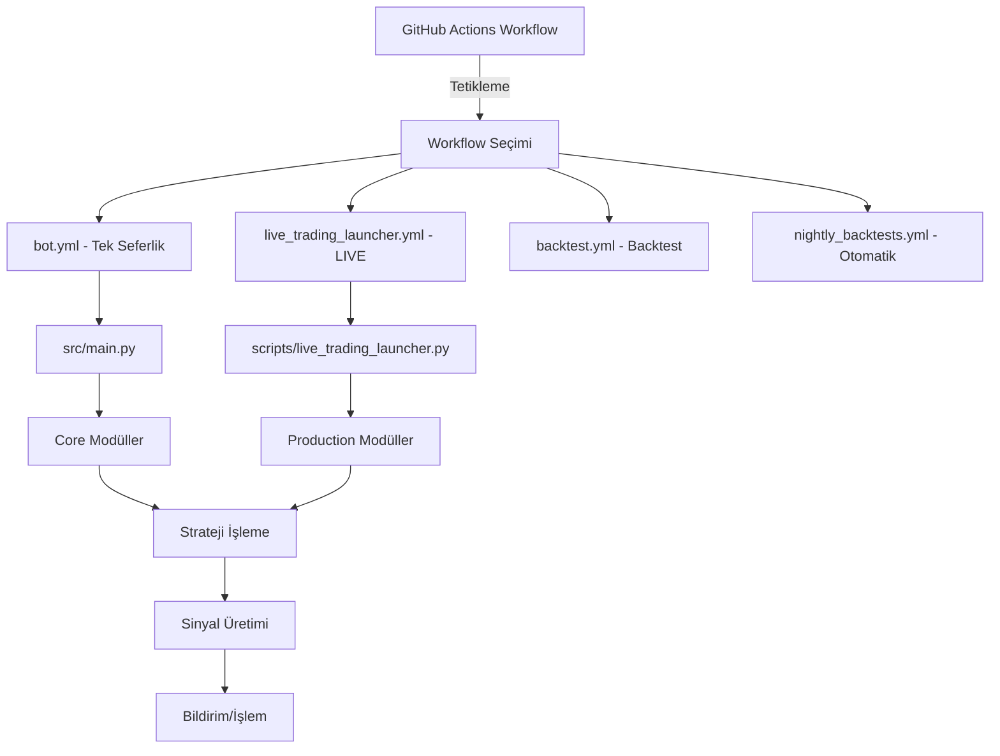

# 🗺️ Bearish Alpha Bot - Sistem Akış Diyagramı ve Entegrasyon Haritası

## 📊 Ana Sistem Akışı



## 🔄 Detaylı Veri Akışı ve Dosya Entegrasyonu

### 1️⃣ **BAŞLANGIÇ NOKTASI (Entry Points)**

```
GitHub Actions (.github/workflows/)
├── bot.yml                    → src/main.py (tek seferlik)
├── live_trading_launcher.yml  → scripts/live_trading_launcher.py (LIVE)
├── backtest.yml               → src/backtest/param_sweep.py
├── backtest_str.yml           → src/backtest/param_sweep_str.py
└── nightly_backtests.yml      → scripts/summarize_backtests.py
```

### 2️⃣ **ANA ÇALIŞTIRMA MODLARI**

#### A. **Paper/Test Mode** (src/main.py)
```
main.py
├── load_config() → config/config.example.yaml
├── build_clients_from_env() → core/multi_exchange.py
│   └── CcxtClient → core/ccxt_client.py
├── build_universe() → src/universe.py
├── fetch_ohlcv() → core/ccxt_client.py
├── ind_enrich() → core/indicators.py
├── is_bearish_regime() → core/regime.py
├── STRATEGY SELECTION:
│   ├── IF adaptive_strategies.enable = true:
│   │   ├── AdaptiveOversoldBounce → strategies/adaptive_ob.py
│   │   └── AdaptiveShortTheRip → strategies/adaptive_str.py
│   └── ELSE (base strategies):
│       ├── OversoldBounce → strategies/oversold_bounce.py
│       └── ShortTheRip → strategies/short_the_rip.py
├── execute_signal() → core/exec_engine.py (paper only)
├── Telegram notifications → core/notify.py
└── save_signals_csv() → data/signals_*.csv
```

#### B. **Live Trading Mode** (scripts/live_trading_launcher.py)
```
live_trading_launcher.py
├── _initialize_config() → config/config.example.yaml
├── _initialize_exchanges() → core/multi_exchange.py
├── _initialize_strategies()
│   ├── IF adaptive enabled:
│   │   ├── AdaptiveOversoldBounce
│   │   └── AdaptiveShortTheRip
│   └── ELSE:
│       ├── OversoldBounce
│       └── ShortTheRip
├── _initialize_monitoring()
│   ├── adaptive_monitor → core/adaptive_monitor.py
│   └── health monitoring
├── ProductionCoordinator → scripts/production_coordinator.py
│   ├── process_symbol()
│   ├── _check_daily_limits()
│   └── _execute_with_retry()
├── LiveTradingEngine → scripts/live_trading_engine.py
│   ├── _signal_processing_loop()
│   ├── _execute_signal()
│   └── _manage_positions()
└── Continuous Loop (infinite mode)
```

### 3️⃣ **CORE MODÜLLER ENTEGRASYONU**

```
core/
├── ccxt_client.py (Exchange API)
│   ├── ohlcv() - Veri çekimi
│   ├── fetch_ohlcv_bulk() - Toplu veri
│   ├── markets() - Market bilgileri
│   └── create_order() - Emir gönderimi
│
├── indicators.py (Teknik Göstergeler)
│   ├── rsi()
│   ├── atr()
│   └── ema() → ema21, ema50, ema200
│
├── multi_exchange.py (Borsa Yönetimi)
│   └── build_clients_from_env()
│       ├── ENV: EXCHANGES
│       ├── ENV: BINGX_KEY/SECRET
│       └── ENV: KUCOIN_KEY/SECRET/PASSWORD
│
├── regime.py (Market Rejimi)
│   └── is_bearish_regime() - 4H timeframe analizi
│
├── sizing.py (Pozisyon Büyüklüğü)
│   └── position_size_usdt()
│
├── limits.py (Lot/Notional Limitleri)
│   ├── clamp_amount()
│   └── meets_or_scale_notional()
│
├── adaptive_monitor.py (YENİ - Adaptive İzleme)
│   ├── record_adaptive_signal()
│   ├── get_symbol_stats()
│   └── get_summary()
│
└── notify.py (Bildirimler)
    └── Telegram.send()
```

### 4️⃣ **STRATEJİ KATMANI**

```
strategies/
├── Base Strategies (Sabit parametreler)
│   ├── oversold_bounce.py
│   │   └── signal() → RSI <= rsi_max
│   └── short_the_rip.py
│       └── signal() → RSI >= rsi_min + EMA alignment
│
└── Adaptive Strategies (Dinamik parametreler)
    ├── adaptive_ob.py
    │   ├── _calculate_adaptive_params()
    │   ├── _get_volatility_regime()
    │   └── signal() → Dinamik RSI threshold
    └── adaptive_str.py
        ├── _calculate_adaptive_params()
        └── signal() → Dinamik RSI threshold
```

### 5️⃣ **VERİ AKIŞ SIRASI (Data Flow)**

```
1. CONFIG YÜKLEME
   config.example.yaml → Python dict

2. EXCHANGE BAĞLANTILARI
   ENV variables → CcxtClient instances → Exchange APIs

3. UNIVERSE SEÇİMİ
   ├── IF fixed_symbols varsa: Sabit liste kullan
   └── ELSE: Tickers → Volume filter → Top N seçimi

4. VERİ TOPLAMA (Her sembol için)
   ├── 30m OHLCV (250 bar)
   ├── 1H OHLCV (250 bar)
   └── 4H OHLCV (250 bar)

5. İNDİKATÖR HESAPLAMA
   Raw OHLCV → indicators.add_indicators() → RSI, ATR, EMA

6. REJİM FİLTRESİ
   4H data → is_bearish_regime() → PASS/SKIP

7. STRATEJİ TARAMASI
   ├── Adaptive mode ON:
   │   ├── Volatilite hesapla
   │   ├── Dinamik threshold belirle
   │   └── Signal üret
   └── Adaptive mode OFF:
       └── Sabit threshold ile signal üret

8. SİNYAL İŞLEME
   ├── Paper mode: Kaydet ve bildir
   └── Live mode:
       ├── Risk hesaplama
       ├── Position sizing
       ├── Order gönderimi
       └── Position takibi

9. RAPORLAMA
   ├── Telegram bildirimi
   ├── CSV kayıt
   ├── State güncellemesi
   └── Performance metrikleri
```

### 6️⃣ **BACKTEST AKIŞI**

```
backtest/param_sweep.py (OB)
├── Grid parameters: rsi_max, tp_pct, sl_atr_mult
├── fetch() → 30m OHLCV
├── simulate_long_nextbar()
└── CSV output → data/backtests/

backtest/param_sweep_str.py (STR)
├── Grid parameters: rsi_min + EMA conditions
├── fetch() → 30m + 1H OHLCV
├── align_1h_to_30m()
├── simulate_short_nextbar()
└── CSV output → data/backtests/
```

### 7️⃣ **WORKFLOW TETİKLEME ZİNCİRİ**

```
Manual trigger (workflow_dispatch)
    ↓
GitHub Actions VM starts
    ↓
Python 3.11 setup
    ↓
pip install requirements.txt
    ↓
Environment variables loaded (Secrets)
    ↓
Main script execution
    ↓
Loop through exchanges → symbols
    ↓
Generate signals
    ↓
Send notifications
    ↓
Upload artifacts
    ↓
Workflow complete
```

### 8️⃣ **LIVE MODE ÖZEL AKIŞ**

```
live_trading_launcher.py
    ↓
Validate inputs (mode, confirm_live)
    ↓
Pre-flight checks (dry-run)
    ↓
Initialize components:
├── Config loader
├── Exchange clients
├── Strategy instances
├── Risk manager
├── Position tracker
└── Health monitor
    ↓
Main trading loop:
├── INFINITE mode: while True
├── AUTO_RESTART: Exception handling
├── Circuit breaker: Safety stops
└── Graceful shutdown
    ↓
Session summary & artifacts
```

### 9️⃣ **KRİTİK DOSYA BAĞIMLILIKLARI**

```yaml
config/config.example.yaml:
  - src/main.py (okur)
  - scripts/live_trading_launcher.py (okur)
  - strategies/adaptive_*.py (parametre alır)

src/universe.py:
  - src/main.py (kullanır)
  - scripts/production_coordinator.py (kullanır)

core/multi_exchange.py:
  - TÜM ana scriptler (kullanır)
  - Backtest scriptleri (kullanır)

core/indicators.py:
  - TÜM strateji modülleri (kullanır)
  - Backtest scriptleri (kullanır)
```

### 🔟 **HATA YÖNETİMİ ZİNCİRİ**

```
Exception occurs
    ↓
Try block catches
    ↓
Logger records (core/ccxt_client.py → 3 retry)
    ↓
Telegram notification (if configured)
    ↓
State saved (data/state.json)
    ↓
Circuit breaker check (live mode)
    ↓
Auto-restart decision (if enabled)
    ↓
Health report generated
```

## 📌 ÖZET

**Ana Giriş Noktaları:**
1. `src/main.py` - Paper/test mode için
2. `scripts/live_trading_launcher.py` - Live trading için
3. `src/backtest/param_sweep*.py` - Backtest için

**Kritik Entegrasyonlar:**
- Config → Strategies → Signals
- Multi-exchange → CCXT → Data
- Indicators → Strategies → Decisions
- Risk → Sizing → Execution
- Monitoring → Alerts → Logs

**Veri Akış Sırası:**
Config → Exchange → Universe → OHLCV → Indicators → Regime → Strategy → Signal → Execution → Report

Bu diyagram, sistemin tüm parçalarının nasıl birbirine bağlandığını ve veri akışının nasıl ilerlediğini gösteriyor. Her modül belirli bir görevi yerine getiriyor ve birbirleriyle tanımlı arayüzler üzerinden iletişim kuruyor.
